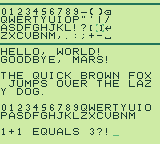
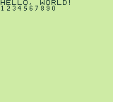

# GBZ80 Playground

The original [Game Boy](https://en.wikipedia.org/wiki/Game_Boy) operates using a modified Z80 processor. This repository includes the Game Boy apps I created along my journey to learn GBZ80 programming.

## Statistics

Here are some statistics for my work in this repository:

- **Time Spent:** 15 hours, 3 minutes, and 49 seconds (via [WakaTime for Neovim](https://wakatime.com/neovim))
- **Programs Created:** 5

I documented the code heavily with comments for my own reference, but hopefully they serve as good documentation for anyone trying to learn from my code.

## Acknowledgements

Special thanks to [gbdev.io](https://gbdev.io) for providing precise technical documentation for the Game Boy.

Also, I'd like to acknowledge the [Game Boy Coding Adventure](https://nostarch.com/game-boy-coding-adventure) book by Maximilien Dagois for providing beginner-friendly technical explanations of the Game Boy (including the hardware layout and assembly language instructions).

## License

This is free and unencumbered software released into the public domain under the Unlicense. You are free to modify, copy, publish, use, compile, sell, or distribute this software for both commercial and non-commercial purposes.

For more details, see the [LICENSE](LICENSE) file.
